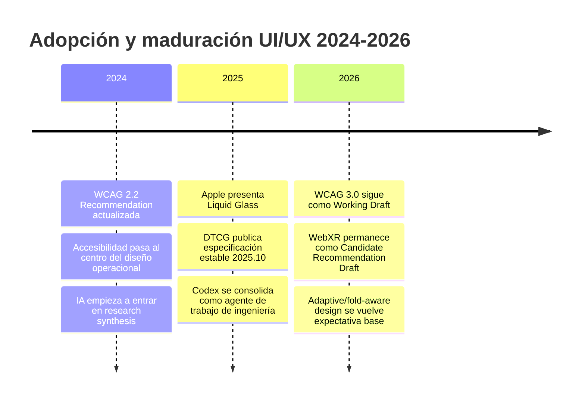
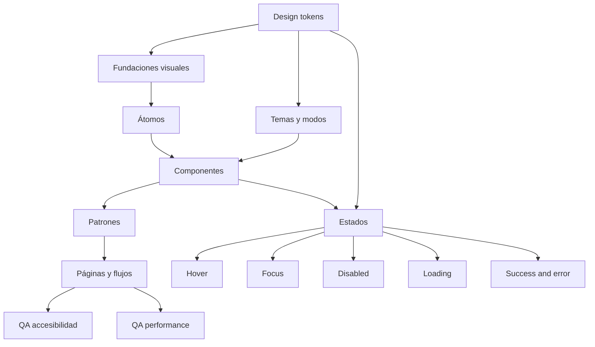
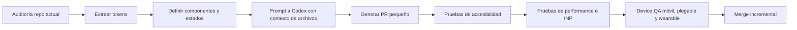

# Tendencias, técnicas y estándares emergentes de UI/UX hacia 2026

## Resumen ejecutivo

Entre 2024 y 2026, el diseño UI/UX dejó de girar solo alrededor de “pantallas bonitas” y pasó a organizarse alrededor de cinco ejes más estructurales: accesibilidad verificable, sistemas de diseño tokenizados, interfaces adaptativas para múltiples factores de forma, uso de IA como copiloto de investigación y producción, y una capa creciente de privacidad, seguridad y confort perceptual. En estándares, el punto de referencia operativo sigue siendo **WCAG 2.2**, mientras **WCAG 3.0** continúa siendo una **Working Draft** y, por tanto, una dirección futura más que una base inmediata de cumplimiento. En implementación, **WAI-ARIA 1.2** y el **ARIA Authoring Practices Guide** siguen siendo la capa práctica para componentes y widgets complejos. citeturn1view0turn2view0turn2view2turn2view3

La segunda gran transición es que los sistemas de diseño ya no se entienden solo como bibliotecas visuales, sino como **infraestructura interoperable**. La **Design Tokens Community Group** de W3C publicó en octubre de 2025 su primera versión estable de especificación, con soporte explícito para theming, relaciones entre tokens, colores modernos y consistencia cross-platform. Eso vuelve obsoleta la práctica de sincronizar manualmente variables entre Figma, web, iOS y Android; hacia 2026, el estándar de facto es trabajar con tokens como fuente de verdad y componer componentes, estados y temas sobre esa base. citeturn6view0turn7view0

La tercera conclusión es que la IA ya no es solo herramienta de ideación: se está integrando en **research synthesis, prototipado, refactor, documentación, testing y revisión**, pero con límites claros. Un estudio de 2025 sobre uso emergente de GenAI en UX research muestra oportunidades para acelerar análisis cualitativos, pero también problemas de confianza, sobreestimación de capacidades y fricción entre roles. En paralelo, OpenAI posiciona **Codex** como un agente de desarrollo capaz de prototipar, refactorizar, revisar y probar, y sus guías oficiales convergen en una estructura de prompting muy útil para UI/UX: **identidad, instrucciones, ejemplos, contexto, criterios de aceptación y evaluación**. citeturn21academia1turn32view0turn34view0turn35view1

La cuarta conclusión es de forma: “responsive” ya no basta. Android documenta con claridad la diferencia entre **responsive** y **adaptive**, recomienda **window size classes**, y para dispositivos plegables exige que la UI sea **fold-aware**, tratando pliegues y bisagras como separadores naturales del layout. Wearables, además, empujan hacia experiencias **glanceable** y de ejecución en segundos. En spatial/AR/VR, la web sigue madurando sobre **WebXR**, que en marzo de 2026 seguía como **Candidate Recommendation Draft** con secciones explícitas de seguridad, privacidad y confort. citeturn14view0turn14view1turn14view2turn14view3turn14view4turn25view0

La quinta conclusión es estética y perceptual. La dirección visual más visible rumbo a 2026 es hacia materiales dinámicos, capas translúcidas y navegación más viva —Apple lo ejemplifica con **Liquid Glass**—, pero ese lenguaje solo es sostenible si se equilibra con **contraste, foco, reducción de movimiento y budgets de performance**. En otras palabras: visualmente, 2026 premia interfaces más ricas; técnicamente, castiga cualquier riqueza que degrade legibilidad, orientación, accesibilidad o velocidad de respuesta. citeturn17view1turn9view0turn10view0turn10view2turn10view3

Una sexta capa práctica es la selección responsable de librerías gratuitas/open-source: Tailwind, Radix, shadcn/ui, Motion, GSAP, Lottie, Lenis, three.js, axe-core, Playwright y Storybook pueden acelerar sistemas visuales, componentes, motion y QA, pero deben filtrarse por licencia, performance, accesibilidad y ajuste arquitectónico. En `Burgers-exe`, por las reglas actuales del proyecto, estas herramientas deben usarse como referencia de patrones y no como dependencias directas salvo autorización explícita. citeturn761626view0turn518145view0turn518145view1turn192028view0turn986669view0turn473641view0

## Alcance y metodología

Se inició la investigación con los conectores habilitados solicitados por el usuario, y se verificó la disponibilidad de **google_drive** y **github**. En GitHub se revisó **exclusivamente** el repositorio `jackpoint811-ship-it/Burgers-exe`; en Google Drive apareció, entre otros resultados, un archivo llamado **“Promt funcionalidades y UI.txt”**, útil como antecedente interno de prompting/UI, aunque la base de evidencia del informe se apoya principalmente en fuentes primarias públicas y especificaciones oficiales. fileciteturn12file0L1-L3

Dentro de `Burgers-exe`, la evidencia más relevante para UI/UX está en la página pública de pedidos y su documentación: `cloudflare/public-order/index.html`, `styles.css`, `app.js` y `docs/ui-ux-mobile-first-plan.md`. El repo ya contiene una shell clara de wizard con hero, stepper, contenido por paso, navegación persistente, panel de éxito y consola de estado; también incluye una capa evidente de tokens CSS, media queries, safe-area handling y soporte para `prefers-reduced-motion`. La documentación interna del proyecto además identifica con bastante precisión problemas de acoplamiento, validación, accesibilidad y escalabilidad. fileciteturn5file0L3-L3 fileciteturn7file0L3-L3 fileciteturn8file0L3-L3 fileciteturn10file0L3-L3 fileciteturn11file0L3-L3

El resto del corpus se construyó con una priorización explícita de fuentes primarias y semiprimarias: **W3C/WAI** para estándares, **web.dev** y **Android Developers** para performance, motion y adaptividad, **Apple Newsroom** para la dirección estética reciente de Apple cuando HIG no era recuperable en modo estático, **Fluent 2** para patrones de componentes y accesibilidad de uso, publicaciones académicas recientes para IA en UX research y accesibilidad inmersiva, y **OpenAI** para la sección de prompts de Codex. citeturn1view0turn2view0turn2view2turn2view3turn6view0turn7view0turn9view0turn10view0turn10view2turn14view0turn14view2turn14view3turn14view4turn17view1turn19view1turn19view2turn21academia1turn21academia4turn25view0turn32view0turn34view0turn35view1

## Panorama de tendencias 2024-2026

La mejor forma de leer el panorama 2024-2026 no es como una lista de “modas”, sino como una redistribución de prioridades del stack de diseño. La siguiente matriz resume el cambio.

| Área | Señal dominante 2024-2026 | Qué cambia para equipos de producto | Evidencia |
|---|---|---|---|
| UX research | La IA acelera síntesis y análisis, pero no reemplaza el juicio interpretativo | Research ops, análisis de entrevistas y clustering se automatizan parcialmente; la validación humana sigue siendo crítica | citeturn21academia1 |
| Accesibilidad | WCAG 2.2 es el baseline actual; WCAG 3.0 sigue en borrador | La accesibilidad pasa de auditoría final a criterio de arquitectura y QA continuo | citeturn1view0turn2view0turn2view2turn2view3 |
| IA/ML en UX | Las herramientas pasan de ideación a implementación y revisión | Prompts, reglas de integración, pruebas de estados y rúbricas se vuelven parte del proceso de diseño | citeturn32view0turn34view0turn35view1 |
| Diseño inclusivo | Se expande desde discapacidad hacia contexto, ergonomía y multimodalidad | Hay que diseñar para teclado, lector, touch, pantallas pequeñas, pliegues, muñeca y espacialidad | citeturn1view0turn14view3turn14view4turn21academia4 |
| Voz y multimodalidad | La voz útil se desplaza hacia experiencias híbridas voz + texto + visuales | Confirmación visible, corrección de errores y estado conversacional pasan a ser obligatorios | citeturn24news2turn21academia6 |
| AR/VR y spatial | WebXR madura, pero con fuerte énfasis en privacidad, seguridad y confort | Spatial UX deja de ser solo visualización: requiere consentimiento, baja latencia y prevención de disconfort | citeturn25view0turn21academia4 |
| Plegables y wearables | Adaptive layout y posture-aware design ya no son opcionales | El layout se decide por ventana/postura, no por “tipo de dispositivo” | citeturn14view1turn14view2turn14view3turn14view4 |
| Sostenibilidad | Se vuelve una práctica de ligereza operativa más que un estilo visual | Menos peso, menos terceros, menos motion innecesario y más reutilización vía tokens | citeturn9view0turn6view0turn7view0 |
| Ética y privacidad | Las especificaciones empiezan a incorporar privacidad y seguridad de forma más explícita | Diseñar implica explicar mejor datos, consentimiento, trazabilidad y límites de automatización | citeturn1view0turn2view2turn25view0turn32view0 |

Hay un patrón transversal detrás de esa tabla: **la interfaz se está volviendo más sensible al contexto**. Cambia según tamaño de ventana, postura del dispositivo, preferencia de movimiento, modos claro/oscuro, flujos asistidos por IA, y, en el caso de XR, incluso según permisos, sensores y confort del usuario. Esto empuja a abandonar layouts “estáticos” y a pensar en **sistemas de estados** más que en páginas aisladas. Android lo formaliza al distinguir responsive y adaptive, y al recomendar decisiones basadas en el espacio real de ventana, no en etiquetas rígidas de dispositivo. citeturn14view0turn14view2

En accesibilidad, la señal más fuerte es que **WCAG 2.2 dejó de ser “la próxima versión” y pasó a ser la referencia vigente**. W3C recomienda usar la versión más actual y, aunque WCAG 3.0 avanza, sigue explicitando que es un trabajo en progreso que no debe citarse como algo distinto a un work in progress. Para equipos de producto, eso significa algo muy concreto: planificar hoy contra WCAG 2.2, pero diseñar la arquitectura de componentes de forma que la futura transición a WCAG 3 no sea traumática. citeturn1view0turn2view0

En lo visual, 2025 introdujo una señal fuerte desde Apple: **Liquid Glass** propone controles, barras y sidebars más dinámicos, translúcidos y dependientes del contexto, inspirados en visionOS y en render en tiempo real. Eso no significa que todo producto deba “apple-izarse”, pero sí que la industria está legitimando otra vez materiales con profundidad, comportamiento y capas funcionales separadas del contenido. La advertencia importante es que este tipo de lenguaje visual exige más disciplina en contraste, jerarquía, foco y reducción de movimiento que los lenguajes planos de la década pasada. citeturn17view1turn10view0turn10view1



La línea temporal anterior no representa “modas” homogéneas, sino **capas de adopción**: primero cambian los estándares, luego las guías de plataforma, luego las herramientas y, finalmente, las prácticas cotidianas de equipos. Esa secuencia es importante porque permite priorizar inversiones: primero componentes y tokens; luego QA de accesibilidad/performance; después copilotos de IA; y solo al final capas estéticas más expresivas. citeturn1view0turn2view0turn6view0turn7view0turn17view1turn25view0

## Técnicas y patrones de interfaz

La técnica dominante hacia 2026 no es una animación en particular ni un patrón hero; es la capacidad de convertir una interfaz en un **sistema coherente de componentes, estados y reglas de adaptación**. Por eso, microinteracciones, motion responsive, atomicidad y tokenización no deben leerse por separado: forman una misma cadena de decisión. OpenAI lo formula de manera útil para front-end engineering en grandes codebases: los prompts que mejor funcionan incluyen principios visuales, especificación UI/UX, estructura de archivos, componentes reutilizables, plantillas de página y pruebas de estados. Esa lista coincide casi punto por punto con cómo hoy se diseñan y mantienen sistemas UI maduros. citeturn35view1

En microinteracciones, la meta ya no es “hacer que algo se mueva”, sino **hacer visible la causalidad**: confirmar selección, anticipar navegación, marcar progreso, comunicar carga o éxito, y reducir incertidumbre. El repo `Burgers-exe` ya tiene varios buenos elementos de esta capa: stepper con `transition` de ancho, `optionPulse`, `qtyPulse`, `miniFlash`, spinner de envío y entrada animada de panel de éxito. También respeta `prefers-reduced-motion`, lo cual muestra una base correcta: una microinteracción es útil si mejora orientación, no si añade ruido. fileciteturn7file0L3-L3 fileciteturn8file0L3-L3 citeturn10view0turn10view1

En motion guidelines, la práctica recomendada hoy es **motion con bifurcación explícita**: una ruta “no-preference” más expresiva y otra ruta “reduce” que preserve funcionalidad sin depender del movimiento. web.dev incluso sugiere cargar estilos de animación condicionalmente para no forzar a usuarios con reduced motion a descargar CSS innecesario. Esa es una señal importante: motion ya no es solo estética; también es una decisión de accesibilidad y performance. citeturn10view0turn10view1

En sistemas de diseño, el cambio decisivo es la **tokenización**. La especificación estable del Design Tokens Community Group permite theming, aliases, relaciones ricas y consistencia entre plataformas. Traducido a práctica, esto significa que una paleta, una escala tipográfica o una escala de espaciado no debería vivir como “variables sueltas”, sino como un contrato interoperable. `Burgers-exe` ya da el primer paso con tokens CSS como `--bg`, `--panel`, `--line`, `--text`, `--radius-*`, `--space-*` y `--tap-min`; el siguiente paso lógico es sacar esos valores a una fuente neutral compatible con un pipeline de tokens, manteniendo CSS como salida, no como origen. citeturn6view0turn7view0 fileciteturn7file0L3-L3

La distinción entre **responsive** y **adaptive** también debe tratarse con precisión. Android define responsive como la capacidad de que un layout responda a variaciones de espacio disponible; adaptive, en cambio, aparece cuando un layout responsive ya no basta y se necesitan **alternativas optimizadas** para determinadas dimensiones o configuraciones. Ese matiz importa mucho: tarjetas, formularios y navegación no deberían simplemente “encogerse” en una tablet o un plegable, sino posiblemente cambiar de estructura a un patrón list-detail, dos paneles o separación por bisagra. citeturn14view0turn14view1turn14view2

### Comparativa de componentes y recomendaciones de uso

| Componente | Cuándo usarlo | Recomendación 2026 | Error común | Soporte |
|---|---|---|---|---|
| Tarjetas | Cuando cada bloque representa un concepto u objeto autónomo | Mantener jerarquía header/body/footer, acciones claras y selectabilidad explícita solo si existe una acción dominante | Usarlas como mero “decorado” o duplicar acciones dispersas | Fluent define card como contenedor de un solo concepto/objeto y exige consistencia de uso; además detalla foco y selectabilidad. citeturn19view1 |
| Listas | Cuando importa escaneo rápido, orden y densidad | Preferir listas para comparaciones y cards para entidades ricas; en grande usar list-detail adaptativo | Convertir cada fila en mini-card pesada y romper el ritmo de lectura | Android recomienda list-detail adaptativo en pantallas grandes. citeturn14view1turn14view2 |
| Formularios | Cuando hay captura secuencial, validación y dependencias | Etiquetas siempre visibles, helper text persistente, estados de error inline, foco robusto | Confiar en placeholder como instrucción principal | Fluent desaconseja usar placeholder como información esencial y obliga a combinarlo con label/helper text. citeturn19view2 |
| Navegación | Cuando existe cambio de contexto o nivel de información | En móvil, CTA y navegación primaria deben mantenerse accesibles; en desktop, se pueden expandir a barras laterales o layouts de dos paneles | Ocultar demasiado la navegación o generar barras pegajosas que tapan foco o teclado | Apple muestra tab bars/sidebars que se encogen o expanden para devolver foco al contenido; Android recomienda navegación responsive. citeturn17view1turn14view0 |

### Relación entre tokens, componentes y estados



El valor del diagrama no está en la terminología, sino en el orden de dependencia: **si los estados no están tokenizados y documentados, el sistema no es realmente escalable**. Eso se ve bien en `Burgers-exe`: el repo ya normaliza focus visible, estados checked, hover, active, success y error sobre la misma base de color/spacing/radius; por eso resulta buen candidato para evolucionar a un sistema tokenizado más formal sin rehacer toda la interfaz. fileciteturn7file0L3-L3 fileciteturn8file0L3-L3

## Estándares y buenas prácticas

El mapa de estándares relevantes para 2026 es más claro de lo que parece: **WCAG 2.2 para cumplimiento actual, WCAG 3.0 para orientación futura, ARIA/APG para implementación de componentes complejos, DTCG para interoperabilidad de design tokens, y Core Web Vitals/performance budgets para gobernar la experiencia perceptual**. A eso se suma WebXR para spatial interfaces, donde los requisitos de privacidad y confort aparecen ya en la propia especificación. citeturn1view0turn2view0turn2view2turn2view3turn7view0turn10view2turn25view0

### Estado de estándares y práctica recomendada

| Estándar o guía | Estado hacia mayo de 2026 | Qué significa para un equipo UI/UX |
|---|---|---|
| WCAG 2.2 | Recomendación W3C vigente; W3C aconseja usar la versión más actual | Diseñar y auditar contra 2.2; especial atención a foco, drag, target size, ayuda consistente y autenticación accesible. citeturn1view0 |
| WCAG 3.0 | Working Draft de 3 de marzo de 2026; explícitamente “work in progress” | Úsala para estrategia y madurez, no como base jurídica principal de compliance. citeturn2view0turn2view1 |
| WAI-ARIA 1.2 | Recommendation desde 2023 | Úsala para nombre/rol/valor, landmarks, widgets dinámicos y estados accesibles cuando HTML nativo no basta. citeturn2view2 |
| APG | Guía viva de patrones y ejemplos | Es la referencia práctica para menús, tabs, diálogos, acordeones, focus management y keyboard support. citeturn2view3 |
| Design Tokens 2025.10 | Especificación estable de comunidad, no W3C Standard, considerada estable para implementación | Conviene adoptarla como formato fuente de tokens y theming entre diseño y desarrollo. citeturn6view0turn7view0 |
| Performance budgets + INP | Buena práctica consolidada; INP es Core Web Vital estable | Define budgets de peso, fuentes, scripts y timing; usa INP p75 ≤ 200 ms como objetivo de buena respuesta. citeturn9view0turn10view2turn10view3 |
| Reduced motion | Media query y patrón de implementación establecidos | Toda motion significativa debe tener ruta `reduce` y, cuando convenga, CSS cargado condicionalmente. citeturn10view0turn10view1 |
| WebXR | Candidate Recommendation Draft | Spatial UX web ya es serio, pero sigue siendo work in progress con fuertes requisitos de latencia, consentimiento y privacidad. citeturn25view0 |

En accesibilidad de componentes, la lección más importante sigue siendo la misma: **preferir semántica nativa y usar ARIA solo cuando un patrón nativo no alcanza**. Aun así, cuando se usan widgets complejos, APG sigue siendo la referencia práctica más útil porque conecta roles, estados y propiedades con **teclado, foco y nombres accesibles**. Ese punto es especialmente importante para stepper, menús, tabs, acordeones, diálogos y selectable cards. citeturn2view2turn2view3turn19view1

En performance, los budgets siguen siendo una herramienta de gobernanza, no solo de optimización. web.dev define un performance budget como un conjunto explícito de límites para métricas de experiencia y explica que no sirve solo para desarrolladores: también ayuda a diseñadores a decidir resolución de imágenes, número de tipografías y coste de nuevas features. Hacia 2026 conviene tratarlo como una política de producto, no como un ticket técnico. citeturn9view0

En pruebas, la práctica madura combina **automatización y verificación manual por capas**. Las capas mínimas que merece la pena institucionalizar son estas:

| Capa de prueba | Qué se verifica | Base recomendada |
|---|---|---|
| Semántica y roles | headings, landmarks, nombre/rol/valor, estados | WCAG 2.2 + ARIA 1.2 + APG. citeturn1view0turn2view2turn2view3 |
| Teclado y foco | orden, foco visible, foco no oculto, traps | WCAG 2.2 + APG. citeturn1view0turn2view3 |
| Formularios | labels persistentes, helper text, errores inline, validación comprensible | WCAG 2.2 + Fluent Input guidance. citeturn1view0turn19view2 |
| Motion | equivalencia funcional con `prefers-reduced-motion` | web.dev + WCAG 2.2. citeturn10view0turn10view1turn1view0 |
| Adaptividad | window size classes, list-detail, fold/hinge separation | Android adaptive docs. citeturn14view1turn14view2turn14view3 |
| Respuesta | budgets y INP p75 | web.dev. citeturn9view0turn10view2turn10view3 |


## Librerías gratuitas y open-source recomendadas para UI/UX 2026

Una lectura práctica del ecosistema 2026 es que las librerías ya no deberían elegirse solo por “verse modernas”, sino por su aporte a cinco capacidades: **sistema visual consistente**, **componentes accesibles**, **motion controlado**, **validación/testing** y **documentación de componentes**. La mayoría de herramientas recomendables para este contexto tienen licencias permisivas como MIT, ISC o Apache 2.0; la excepción relevante es **axe-core**, que usa MPL 2.0, y **GSAP**, que actualmente se presenta como gratuito para todos pero no debe asumirse automáticamente como MIT. citeturn761626view0turn761626view1turn518145view0turn518145view1turn192028view0turn192028view1turn591318view0turn591318view1turn986669view0turn473641view0turn328884view1

Para proyectos nuevos con build system moderno —por ejemplo React, Next.js, Vite o una web app modular— el stack más equilibrado sería **Tailwind CSS + Radix UI o Headless UI + Motion + Playwright + axe-core + Storybook**. Para proyectos con identidad muy visual, puede añadirse GSAP, Lottie o three.js, siempre con un performance budget claro. Para productos operativos y transaccionales, como un flujo de pedidos, conviene priorizar componentes accesibles, estados, feedback de carga, validación y pruebas antes que efectos visuales complejos.

### Matriz principal de librerías

| Categoría | Librería | Condición gratuita / licencia | Para qué sirve | Cuándo conviene usarla | Cuándo NO conviene usarla | Riesgos a controlar |
|---|---|---|---|---|---|---|
| CSS y sistema visual | **Tailwind CSS** | MIT | Framework utility-first para construir layouts, espaciado, colores, tipografía y responsive sin crear clases CSS nuevas para cada caso. | Proyectos con build system, design tokens claros y necesidad de iterar rápido. | Proyectos vanilla muy pequeños o entornos donde no se autoricen dependencias/build step. | HTML con demasiadas clases, drift visual si no se gobiernan tokens, y bundle/CSS mal purgado. citeturn761626view0 |
| Componentes copy-paste | **shadcn/ui** | MIT | Colección de componentes editables, pensada para copiar código al proyecto y adaptarlo al sistema visual propio. | React/Next.js donde se quiere una base visual premium sin depender de una librería cerrada. | Apps sin React o proyectos que no quieren adoptar Tailwind/Radix como base. | Confundirlo con una librería “instalable” tradicional; requiere criterio para mantener consistencia. citeturn761626view1 |
| Componentes accesibles | **Radix UI Primitives** | MIT | Primitivos headless para diálogos, menús, popovers, tabs, tooltips y estados accesibles. | Cuando se necesita accesibilidad robusta con control total del estilo. | Proyectos donde HTML nativo basta o donde el equipo no puede mantener componentes compuestos. | Sobre-ingeniería y dependencia excesiva de JS para patrones simples. citeturn518145view0 |
| Componentes accesibles | **Headless UI** | MIT | Componentes headless de Tailwind Labs para menús, comboboxes, dialogs, tabs y transiciones. | React/Vue con Tailwind, especialmente para patrones comunes que ya tienen comportamiento accesible. | Proyectos que necesitan primitives más granulares o que no usan React/Vue. | Personalización avanzada puede volverse rígida si se fuerza fuera de su modelo. citeturn828935view1 |
| Positioning UI | **Floating UI** | MIT | Motor para posicionar floating elements como tooltips, dropdowns, menus y popovers. | Interfaces con overlays, tooltips, autocomplete, menús contextuales o popovers responsive. | Sitios simples sin overlays complejos. | Z-index, foco, scroll containers y collisions mal resueltas si no se prueba en mobile. citeturn828935view0 |
| Animación UI | **Motion** | MIT | Animaciones declarativas, transitions, layout animations y gestos para React/JS/Vue. | Microinteracciones, entrada/salida de cards, feedback de selección, loaders y estados de éxito. | Apps con restricciones fuertes de peso o sin necesidad real de animación. | Abuso de motion, mareo, falta de ruta `prefers-reduced-motion` y animaciones que bloquean interacción. citeturn518145view1 |
| Animación avanzada | **GSAP** | Gratis para todos según su página oficial | Animación profesional para SVG, scroll, timelines, motion paths, secuencias y experiencias altamente visuales. | Landing pages, campañas, storytelling visual o experiencias con animación como parte central de la marca. | Flujos transaccionales simples, formularios críticos o apps donde cada KB cuenta. | No tratarlo como MIT; revisar términos antes de producción, cuidar performance y reduced motion. citeturn192028view0 |
| Animaciones exportadas | **lottie-web** | MIT | Reproducción de animaciones Lottie/Bodymovin en web. | Loaders, empty states, success states, onboarding, ilustraciones animadas de marca. | Cuando una animación CSS simple comunica lo mismo con menos peso. | JSONs pesados, mala legibilidad, autoplay excesivo y falta de fallback estático. citeturn192028view1 |
| Scroll y sensación premium | **Lenis** | MIT | Smooth scrolling e integración de scroll controlado para experiencias editoriales. | Landing pages, portfolios, campañas y sitios con narrativa visual. | Apps operativas, forms, flujos de checkout o páginas donde el scroll nativo es más predecible. | Interferir con accesibilidad, teclado, anchor links, historial y sensación nativa del dispositivo. citeturn591318view0 |
| 3D / WebGL | **three.js** | MIT | Gráficos 3D, escenas WebGL/WebGPU, productos interactivos, fondos y visualizaciones. | Experiencias inmersivas, visualizadores de producto o branding 3D medido. | Flujos de pedido, formularios, dashboards operativos o apps donde 3D no mejora la tarea. | Peso, GPU, batería, mareo, accesibilidad, loading y fallbacks para dispositivos modestos. citeturn591318view1 |
| Iconografía | **Lucide** | ISC, con derivados de Feather bajo MIT | Set de íconos open-source limpios, consistentes y fáciles de adaptar. | Sistemas visuales que necesitan iconografía simple, legible y coherente. | Cuando se requiere iconografía muy ilustrativa o propietaria. | Íconos sin label accesible, exceso decorativo y mezcla de estilos visuales. citeturn920241view0 |
| Visualización de datos | **Chart.js** | MIT | Gráficas canvas simples para dashboards, reportes y visualizaciones rápidas. | Métricas, paneles operativos y reportes donde se necesita claridad más que visualización científica compleja. | Casos con muchísimos datos, interactividad avanzada o requerimientos de SVG/DOM accesible. | Accesibilidad de canvas, labels alternativos, performance con datasets grandes y exceso de colores. citeturn920241view1 |
| Accesibilidad QA | **axe-core** | Mozilla Public License 2.0 | Motor de auditoría automática de accesibilidad para detectar violaciones comunes. | Integrarlo en QA, CI, Playwright, Storybook o pruebas locales. | Como sustituto de pruebas manuales con teclado, lector de pantalla y usuarios reales. | Falsos negativos: pasar axe no significa cumplir toda la accesibilidad. citeturn986669view0 |
| Testing E2E | **Playwright** | Apache License 2.0 | Pruebas end-to-end, multi-browser, responsive y de flujos críticos. | Checkout, formularios, navegación por pasos, estados de error, capturas visuales y regresión móvil. | Prototipos desechables o proyectos sin capacidad de mantener pruebas. | Tests frágiles si se acoplan a selectores visuales; conviene usar roles, labels y data-testid bien gobernados. citeturn473641view0 |
| Documentación UI | **Storybook** | MIT | Catálogo de componentes, estados, documentación viva, pruebas visuales y colaboración diseño-dev. | Sistemas de diseño, equipos medianos/grandes y componentes con muchas variantes. | Proyectos pequeños donde el costo de mantenimiento supera el valor. | Duplicar documentación si no se conecta con el código real y estados reales. citeturn328884view1 |

### Stack recomendado por escenario

| Escenario | Stack recomendado | Justificación |
|---|---|---|
| App moderna React/Next.js | Tailwind CSS + shadcn/ui + Radix UI + Motion + Playwright + axe-core | Cubre sistema visual, componentes, animación controlada y QA. Es el stack más equilibrado para moverse rápido sin sacrificar accesibilidad. |
| Landing page premium | Tailwind CSS + GSAP + Lottie + Lenis + axe-core | Permite una estética expresiva, motion avanzado y storytelling; requiere budget estricto y fallback de movimiento reducido. |
| Dashboard operativo | Tailwind CSS + Radix UI + Chart.js + Playwright + axe-core + Storybook | Prioriza claridad, estados, navegación, gráficas comprensibles y documentación de componentes. |
| Design system maduro | Radix UI o Headless UI + Storybook + axe-core + Playwright + tokens DTCG | Ideal para convertir componentes en infraestructura reusable, verificable y documentada. |
| Experiencia 3D / producto interactivo | three.js + GSAP o Motion + Playwright + fallback estático | Adecuado solo cuando 3D resuelve una necesidad real de visualización o branding. |
| Proyecto vanilla restringido | HTML/CSS/JS propio + patrones inspirados en Radix/Motion/axe/Playwright | Útil cuando no se autorizan dependencias, pero se quiere adoptar buenas prácticas sin importar librerías. |

### Criterios para decidir si una librería entra o no

Antes de autorizar una dependencia conviene pasarla por una matriz simple:

| Criterio | Pregunta de decisión | Señal positiva | Señal negativa |
|---|---|---|---|
| Valor de UX | ¿Reduce fricción, mejora claridad o aumenta conversión? | Mejora estados, validación, navegación, accesibilidad o feedback | Solo “se ve cool” |
| Accesibilidad | ¿Respeta teclado, foco, roles, labels y reduced motion? | Tiene patrones accesibles y se puede probar | Rompe scroll, foco o navegación nativa |
| Performance | ¿Cumple el budget de JS/CSS/imágenes? | Se puede tree-shake, lazy-load o usar por componente | Añade peso global para una función menor |
| Mantenibilidad | ¿El equipo puede entenderlo y modificarlo? | Código editable, docs claras, comunidad activa | Caja negra o patrón difícil de depurar |
| Licencia | ¿La licencia es compatible con el uso del proyecto? | MIT, ISC, Apache 2.0 o permiso claro | Gratis ambiguo, licencia dual o términos comerciales no revisados |
| Fit con arquitectura | ¿Encaja con el stack actual? | No rompe contratos ni obliga a migración grande | Requiere framework/build system no autorizado |

### Nota específica para Burgers-exe

Para **Burgers-exe**, estas librerías deben tratarse como **referencia estratégica**, no como implementación automática. La regla actual del proyecto permite Google Sheets + Google Apps Script Web App + HTML/CSS/JS embebido y prohíbe librerías externas, CDNs y frameworks salvo autorización explícita. Por eso, en este repo conviene que Codex replique los patrones de estas herramientas en **vanilla HTML/CSS/JS**: tokens CSS propios en lugar de Tailwind, componentes accesibles inspirados en Radix/APG en lugar de importar primitives, animaciones CSS/JS pequeñas en lugar de Motion/GSAP, y pruebas manuales/semiautomáticas antes de introducir Playwright si no existe un pipeline formal.

La recomendación para `Burgers-exe` sería esta:

| Necesidad en Burgers-exe | Inspiración de librería | Implementación permitida sin nuevas dependencias |
|---|---|---|
| Tokens visuales | Tailwind / DTCG | Mantener `:root` con variables CSS y documentar color, spacing, radius, sombras, tamaños táctiles y estados. |
| Cards de producto/opciones | shadcn/ui / Radix | HTML semántico, botones reales, `aria-pressed` o inputs nativos cuando aplique, foco visible y estados CSS. |
| Dialogs, menus o popovers | Radix / Floating UI | Evitar overlays complejos si no son necesarios; si se usan, gestionar foco, escape, backdrop y retorno de foco manualmente. |
| Motion y feedback | Motion / GSAP / Lottie | Transiciones CSS pequeñas, spinner ligero, success state estático/animado y ruta `prefers-reduced-motion`. |
| Íconos | Lucide | SVG inline propio o set mínimo local; cada icono decorativo con `aria-hidden`, cada icono funcional con label. |
| Accesibilidad | axe-core | Checklist manual: teclado, foco, labels, errores inline, contraste, touch target y reduced motion. |
| Testing de flujo | Playwright | Checklist reproducible de pedido completo en 320px, 390px, tablet y desktop; automatizar después si se autoriza tooling. |
| Documentación | Storybook | Tabla Markdown de componentes, anatomía, estados, variantes y reglas de uso dentro de `/docs`. |

### Prompt para Codex: evaluar e integrar librerías sin romper el proyecto

```text
Actúa como front-end engineer senior y product designer especializado en accesibilidad, performance y sistemas de diseño.

Objetivo:
Evalúa qué patrones de librerías gratuitas/open-source pueden aplicarse al proyecto sin violar sus restricciones técnicas.

Contexto del proyecto:
- Stack permitido: Google Sheets + Apps Script Web App + HTML/CSS/JS embebido.
- No introducir frameworks, CDNs, librerías externas ni dependencias nuevas salvo autorización explícita.
- Mantener enfoque mobile-first.
- Mantener accesibilidad WCAG 2.2 AA como objetivo.
- Mantener soporte para prefers-reduced-motion.
- No romper contratos de datos ni modificar legacy.

Librerías a usar como referencia, NO como dependencias:
- Tailwind CSS para tokens/utility thinking.
- Radix UI / Headless UI para comportamiento accesible.
- Motion / GSAP / Lottie para microinteracciones.
- Lucide para iconografía consistente.
- axe-core para checklist de accesibilidad.
- Playwright para pensar casos de prueba E2E.
- Storybook para documentación de componentes.

Tareas:
1. Revisa los archivos actuales de UI.
2. Identifica 5 patrones que pueden replicarse en vanilla HTML/CSS/JS.
3. No agregues dependencias.
4. Propón cambios mínimos por PR.
5. Para cada patrón, incluye:
   - problema que resuelve,
   - archivo afectado,
   - estado actual,
   - implementación vanilla sugerida,
   - riesgos,
   - checklist de QA.
6. Entrega un plan incremental, no una reescritura completa.

Criterios de aceptación:
- 320px sin overflow horizontal.
- Botones táctiles mínimos de 44px.
- Foco visible en todos los controles.
- Labels persistentes.
- Errores inline claros.
- Estados loading/success/error definidos.
- Reduced motion funcional.
- Sin dependencias nuevas.
```

### Prompt para Codex: proyecto nuevo con librerías autorizadas

```text
Actúa como diseñador/desarrollador front-end senior. Diseña una web app mobile-first con estética 2026, componentes accesibles y microinteracciones discretas.

Stack autorizado:
- React + Vite o Next.js.
- Tailwind CSS para sistema visual.
- Radix UI o shadcn/ui para componentes.
- Motion para microinteracciones.
- Playwright para pruebas E2E.
- axe-core para accesibilidad automatizada.
- Storybook si el proyecto tendrá componentes reutilizables.

Instrucciones:
- Define tokens de color, spacing, radius, sombra, tipografía y motion.
- Crea componentes con estados: default, hover, focus-visible, active, disabled, loading, selected, error y success.
- Diseña cards con header/body/footer, CTA primario claro y selección accesible.
- Usa motion solo para comunicar causalidad: selección, progreso, carga, éxito y cambio de estado.
- Implementa ruta prefers-reduced-motion equivalente.
- No uses animaciones infinitas salvo loaders.
- Mantén Core Web Vitals como restricción: evita bundles innecesarios y lazy-load para recursos pesados.
- Incluye pruebas Playwright para flujo principal y axe-core para auditoría básica.

Entrega:
1. Arquitectura de carpetas.
2. Tokens.
3. Componentes base.
4. Ejemplo de pantalla.
5. Pruebas.
6. Checklist de accesibilidad y performance.
```

En síntesis, las librerías gratuitas más útiles hacia 2026 no son las que “decoran” más, sino las que vuelven la UI más **sistemática, accesible, comprobable y mantenible**. La estética premium se logra mejor cuando la base está clara: tokens primero, componentes después, estados completos, motion con propósito, y pruebas antes de escalar efectos visuales.


## Aplicación práctica a Burgers-exe

`Burgers-exe` es un muy buen caso práctico porque ya contiene varias piezas del “stack 2026” en estado embrionario. La página pública de pedidos tiene un flujo secuencial claro, estructura mobile-first y una navegación sticky con botones persistentes; `styles.css` define tokens de color, spacing, radius y tamaño táctil mínimo; existen estados de selección, foco, éxito, error y motion reducida; y la documentación interna ya identifica el problema principal: el frontend está demasiado concentrado en un `app.js` monolítico y un render basado en `innerHTML`, lo que frena evolución de UX y eleva riesgo de regresión. fileciteturn5file0L3-L3 fileciteturn7file0L3-L3 fileciteturn8file0L3-L3 fileciteturn11file0L3-L3

### Hallazgos del repo y oportunidades de evolución

| Hallazgo actual en el repo | Oportunidad 2026 | Recomendación prioritaria |
|---|---|---|
| Ya existe una capa de tokens CSS (`--bg`, `--panel`, `--line`, `--space-*`, `--tap-min`) | Convertir esos valores en fuente interoperable de sistema de diseño | Migrar a archivo de tokens compatible con DTCG y generar CSS/JSON/platform outputs desde una sola fuente. fileciteturn7file0L3-L3 citeturn6view0turn7view0 |
| El stepper y la navegación por fases son comprensibles, pero el render está muy acoplado | Hacerlo más accesible y mantenible | Separar shell, stepper, formularios y resumen en módulos/componentes con foco gestionado por estado, no por reconstrucción total del DOM. fileciteturn11file0L3-L3 |
| Ya hay `focus-visible`, `prefers-reduced-motion` y `tap-min: 44px` | Convertir buenas intenciones en reglas verificables de QA | Añadir checklist CI/manual para keyboard flow, reduced-motion parity, 320px sin overflow y objetivos táctiles consistentes. fileciteturn7file0L3-L3 fileciteturn8file0L3-L3 citeturn10view0turn10view1turn1view0 |
| La validación es funcional pero la documentación del repo reconoce baja guía contextual | Mejorar tasa de completitud y reducir errores | Llevar errores al nivel de campo, con microcopy específico y resumen global solo como apoyo. fileciteturn11file0L3-L3 citeturn19view2 |
| Hay navegación sticky correcta para móvil | Escalar a tabletas, plegables y list-detail | Mantener sticky en móvil, pero introducir layout adaptativo de dos paneles en ancho medio/grande y postura-aware en plegables. fileciteturn8file0L3-L3 citeturn14view1turn14view2turn14view3 |
| `localStorage` ya soporta draft persistente | Fortalecer continuidad del proceso | Versionar el esquema y añadir feedback más claro de restauración/progreso. fileciteturn10file0L3-L3 fileciteturn11file0L3-L3 |

Una forma concreta de aterrizar esa evolución es convertir la capa de tokens actual en una estructura más explícita. El siguiente ejemplo no describe el estado actual del repo, sino una **salida deseable** alineada con la especificación de design tokens y con los valores que ya existen en `styles.css`:

```json
{
  "color": {
    "bg": { "$type": "color", "$value": "#07090f" },
    "panel": { "$type": "color", "$value": "#111521" },
    "accent": { "$type": "color", "$value": "#3cff7b" },
    "text": { "$type": "color", "$value": "#defee7" },
    "muted": { "$type": "color", "$value": "#9cc9ad" }
  },
  "space": {
    "1": { "$type": "dimension", "$value": "6px" },
    "2": { "$type": "dimension", "$value": "8px" },
    "3": { "$type": "dimension", "$value": "10px" },
    "4": { "$type": "dimension", "$value": "12px" },
    "5": { "$type": "dimension", "$value": "16px" }
  },
  "size": {
    "tap-min": { "$type": "dimension", "$value": "44px" }
  },
  "radius": {
    "sm": { "$type": "dimension", "$value": "10px" },
    "md": { "$type": "dimension", "$value": "12px" }
  }
}
```

Ese cambio importaría más de lo que parece: permitiría documentar variantes, temas, estados, accesibilidad aumentada y futuras salidas para web/app sin duplicar lógica. En un proyecto como `Burgers-exe`, además, reduce el riesgo de drift visual al tocar CSS y JS por separado. fileciteturn7file0L3-L3 citeturn6view0turn7view0

### Flujo recomendado de rediseño para el repo



La lógica del flujo es deliberadamente incremental. La documentación del propio repo recomienda empezar por hardening base y separar responsabilidades antes de un rediseño visible. Esa es la decisión correcta: si primero cambias estética y luego arquitectura, acabas reabriendo todas las capas; si primero estabilizas tokens, componentes y validación, la decoración posterior tiene mucho menos riesgo. fileciteturn11file0L3-L3

## Prompts efectivos para Codex aplicados a UI/UX

Las guías oficiales de OpenAI dan una estructura muy utilizable para prompting aplicado a UI/UX. La más importante es esta: **Identity, Instructions, Examples, Context**. Además, OpenAI recomienda mantener instrucciones reutilizables al inicio del prompt para aprovechar prompt caching, y para trabajo front-end en codebases grandes sugiere añadir categorías explícitas de **principios, UI/UX, estructura, componentes, páginas y agent instructions**; también propone usar **rúbricas** y seguimiento estructurado para no omitir estados ni pasos. En modelos GPT conviene ser más preciso; en modelos de razonamiento se puede dar una meta de más alto nivel. citeturn34view0turn34view1turn35view1

### Estructura recomendada de prompt maestro

```text
# Identity
Eres un diseñador/desarrollador front-end senior especializado en accesibilidad, sistemas de diseño y performance.

# Objective
Resuelve [tarea] en [repo/producto] con calidad de producción.

# Context
Proyecto: [nombre]
Archivos relevantes: [rutas]
Usuarios: [si se conocen]
Estado actual: [problema actual]
Patrones existentes a respetar: [tokens, naming, estructura]

# Instructions
- Mantén consistencia con el sistema visual existente.
- Prioriza WCAG 2.2 AA.
- Define estados hover, focus, disabled, loading, empty, success y error.
- No introduzcas dependencias externas salvo que se autorice.
- Diseña primero para móvil y adapta a tablet/desktop/foldables.
- Si cambias markup, explica por qué mejora la accesibilidad.

# Constraints
- No romper contratos API.
- No modificar archivos legacy.
- Mantener soporte de reduced motion.
- Mantener performance budget.

# Examples
[uno o dos ejemplos de componente o salida esperada]

# Acceptance criteria
- Sin overflow horizontal a 320px.
- Foco visible en todos los controles.
- Labels persistentes y errores inline.
- INP objetivo y presupuesto de peso definidos.
- Entrega diff + explicación + checklist de QA.

# Output format
1. Diagnóstico breve
2. Plan
3. Código
4. Riesgos
5. QA checklist
```

Este formato coincide muy bien con la lógica de `Burgers-exe`, porque el repo ya está organizado alrededor de archivos concretos, restricciones explícitas y una necesidad fuerte de PRs incrementales. También encaja con la guía de OpenAI para front-end en codebases grandes, que explícitamente pide especificar tipografía, colores, spacing, estados, accesibilidad, estructura, wrappers reutilizables y pruebas de estados. citeturn34view0turn35view1 fileciteturn11file0L3-L3

### Quince prompts concretos en español e inglés

La tabla siguiente mezcla prompts generales y prompts aplicados a `Burgers-exe`. En todos los casos, el valor no está solo en “pedir código”, sino en **pedir criterio**, estados, restricciones y métricas de evaluación.

| Caso | Prompt en español | Prompt in English | Resultado esperado | Métricas de evaluación |
|---|---|---|---|---|
| Auditoría UI | “Audita esta pantalla para detectar problemas de jerarquía visual, accesibilidad, feedback, vacíos de estado y fricción de flujo. Devuelve hallazgos priorizados P1/P2/P3 y propuestas accionables.” | “Audit this screen for visual hierarchy, accessibility, feedback, missing states, and flow friction. Return prioritized findings P1/P2/P3 and actionable proposals.” | Lista priorizada de problemas + quick wins | Cobertura de estados; claridad de severidad; acciones implementables |
| Extraer tokens | “A partir de `styles.css`, extrae colores, spacing, radius y tamaños táctiles a una estructura de design tokens compatible con DTCG.” | “From `styles.css`, extract colors, spacing, radius, and tap sizes into a DTCG-compatible design token structure.” | JSON de tokens + mapa CSS→token | 100% de variables críticas tokenizadas; sin drift semántico |
| Stepper accesible | “Rediseña el stepper de `cloudflare/public-order/index.html` para mejorar orientación, foco y semántica accesible sin romper el flujo actual.” | “Redesign the stepper in `cloudflare/public-order/index.html` to improve orientation, focus, and accessible semantics without breaking the current flow.” | Stepper con `aria-current`, anuncios y foco claro | Navegación por teclado completa; comprensión del paso actual |
| Formularios inline | “Refactoriza el paso DATOS para mover la validación de `#status` a mensajes inline por campo, manteniendo un resumen global.” | “Refactor the DATA step so validation moves from `#status` into inline field messages while keeping a global summary.” | Formulario con errores por campo y resumen | Tasa de error visible; labels persistentes; mensajes accionables |
| Placeholder correcto | “Reescribe labels, helper text y placeholders para que el placeholder nunca contenga información esencial.” | “Rewrite labels, helper text, and placeholders so the placeholder never contains essential information.” | Microcopy de captura más robusto | 0 instrucciones críticas en placeholder; legibilidad alta |
| Reduced motion | “Mantén todas las microinteracciones útiles, pero crea una ruta `prefers-reduced-motion: reduce` funcionalmente equivalente.” | “Preserve useful microinteractions, but create a functionally equivalent `prefers-reduced-motion: reduce` path.” | CSS/JS dual-path para motion | Paridad funcional; sin animación obligatoria |
| Fold-aware layout | “Propón una versión fold-aware del flujo de pedido: en postura libro usa dos paneles; en postura tabletop separa resumen y edición.” | “Propose a fold-aware version of the order flow: in book posture use two panes; in tabletop posture separate summary and editing.” | Layout adaptativo por postura | Sin contenido sobre bisagra; tareas críticas visibles |
| Wearable companion | “Diseña una vista wearable glanceable para estado del pedido: fase actual, total, ETA y CTA único.” | “Design a glanceable wearable view for order status: current phase, total, ETA, and one primary CTA.” | Tarjeta mínima para reloj/reloj híbrido | Comprensión en < 3 segundos; un solo objetivo |
| Performance budget | “Define un performance budget para el flujo público: JS, imágenes, fuentes, recursos externos y objetivo de INP.” | “Define a performance budget for the public flow: JS, images, fonts, external resources, and an INP target.” | Presupuesto de peso + thresholds | INP p75 ≤ 200 ms; límites explicitados por recurso |
| Estados de componente | “Genera la matriz de estados para `menu-item`, `choice-row`, `pay-option-card` y botones: default, hover, focus, active, checked, disabled, loading, error.” | “Generate the state matrix for `menu-item`, `choice-row`, `pay-option-card`, and buttons: default, hover, focus, active, checked, disabled, loading, error.” | Documento de estados o tabla | 100% de estados críticos cubiertos |
| Cards vs lists | “Refactoriza el catálogo para usar lista densa en móvil y cards ricas en tablet/desktop, justificando el cambio.” | “Refactor the catalog to use a dense list on mobile and richer cards on tablet/desktop, justifying the change.” | Estrategia híbrida por contexto | Mejor escaneabilidad móvil; mejor riqueza desktop |
| Navegación persistente | “Evalúa si la barra sticky actual tapa foco, teclado o contenido. Propón una navegación persistente más robusta.” | “Assess whether the current sticky bar obscures focus, keyboard, or content. Propose a more robust persistent navigation pattern.” | Ajustes a sticky nav | Sin obstrucción de foco; CTA siempre accesible |
| Spatial UI | “Diseña una variante XR del resumen del pedido usando paneles flotantes simples, mínima carga cognitiva y consentimiento explícito para sensores.” | “Design an XR variant of the order summary using simple floating panels, minimal cognitive load, and explicit sensor consent.” | Wireframe conceptual XR | Baja carga cognitiva; consentimiento claro; confort |
| Documentación de sistema | “A partir del repo, genera documentación viva de componentes con anatomía, props, estados, accesibilidad y ejemplos de uso.” | “From the repo, generate living component documentation with anatomy, props, states, accessibility, and usage examples.” | Spec de componentes lista para handoff | Completitud, claridad y reutilización |
| PR agentic completo | “Actúa como agente de front-end para `Burgers-exe`: planifica, propone cambios mínimos, implementa, documenta, y entrega checklist de QA sin tocar contratos API.” | “Act as a front-end agent for `Burgers-exe`: plan, propose minimal changes, implement, document, and deliver a QA checklist without touching API contracts.” | PR pequeño y seguro | Alcance controlado; cambios trazables; cero ruptura contractual |

### Resultado esperado y salida ideal de Codex

Cuando estos prompts están bien formulados, el resultado ideal de Codex no es solo “código que compila”. Debería entregar, en este orden: diagnóstico, supuestos, plan de cambio, diff acotado, cobertura de estados, explicación de accesibilidad, riesgos y checklist de QA. Esa estructura reproduce muy bien la guía oficial de OpenAI: identidad, instrucciones, ejemplos y contexto; además, para tareas agentic, OpenAI recomienda planificar a fondo, descomponer subtareas, usar seguimiento estructurado y no terminar antes de resolver el problema completo. citeturn34view0turn35view1

### Métricas sugeridas para evaluar prompts de UI/UX

| Dimensión | Qué medir |
|---|---|
| Fidelidad visual | Consistencia con tokens, spacing, tipografía, estados y patrón existente |
| Accesibilidad | Labels visibles, foco claro, orden de teclado, `aria-*` solo cuando hace falta, reduced motion funcional |
| Integración | Respeto por naming, estructura de archivos, contratos API y restricciones del repo |
| Cobertura de estados | hover, focus, active, disabled, empty, loading, success, error |
| Adaptividad | 320px sin overflow, buen comportamiento en tamaños medios/grandes y escenarios foldables |
| Performance | Budget explícito, recursos externos justificados, INP objetivo |
| Calidad de entrega | Plan claro, diff pequeño, explicación comprensible, checklist ejecutable |

## Recomendaciones estéticas y perceptuales

En 2026, una recomendación estética madura ya no separa “look and feel” de percepción y accesibilidad. La mejor interfaz suele ser la que **organiza la atención** con el mínimo coste cognitivo. Apple, por ejemplo, al presentar Liquid Glass, no lo justificó solo como embellecimiento, sino como una forma de devolver foco al contenido y construir una capa funcional clara sobre la app; Fluent, por su lado, insiste en contenido breve y orientado a la acción dentro de cards e inputs; y Wear OS empuja a que la información pueda comprenderse en segundos. La convergencia es clara: la estética buena es la que ayuda a ver, decidir y actuar más rápido. citeturn17view1turn19view1turn19view2turn14view4

### Color

El color de acento debe funcionar como **señal semántica**, no como relleno decorativo. La dirección 2025-2026 favorece materiales más vivos y translúcidos, pero si el contraste cae, la percepción de calidad se rompe enseguida. En interfaces operativas como `Burgers-exe`, el uso del verde neón sobre fondo oscuro ya crea una identidad fuerte; lo recomendable aquí no es “añadir más color”, sino jerarquizar mejor: acento solo para CTA, precios, selección activa, éxito y foco; neutros de alto contraste para texto largo; y escalas separadas para estados críticos. citeturn17view1turn1view0 fileciteturn7file0L3-L3

### Tipografía

La tipografía debe diferenciar con claridad entre **lectura**, **escaneo** y **dato operativo**. Apple destaca cómo incluso los numerales pueden adaptarse para reforzar escena y legibilidad; el repo, por su parte, ya da más peso visual a precios y totales. La recomendación aquí es reforzar esa lógica: una capa de texto operativo para montos, pasos y CTAs; otra para labels y formularios; y otra para ayuda/muted content. La peor decisión en 2026 sigue siendo la misma que en 2016: usar una sola voz tipográfica para todo. citeturn17view1 fileciteturn8file0L3-L3

### Microcopy

El principio más robusto sigue siendo: **lo esencial debe permanecer visible**. Fluent es explícito al decir que el placeholder no debe contener información crítica porque desaparece al enfocar y eso puede perjudicar especialmente a personas con dificultades cognitivas. En consecuencia, labels, helper text, requisitos y errores deben escribirse como partes permanentes del componente, no como pistas efímeras. Para `Burgers-exe`, esto significa pasar de mensajes tipo consola a mensajes formales de formulario sin perder el tono de marca. citeturn19view2 fileciteturn11file0L3-L3

### Jerarquía visual

La jerarquía visual madura combina **capa de contenido**, **capa de navegación** y **capa de feedback**. Apple rediseña controles y navegación como una capa funcional separada; Fluent organiza cards por header/body/footer; y Wear OS exige que la información crítica se vea de un vistazo. En práctica, eso se traduce en cuatro reglas: un punto focal por pantalla, un CTA primario inequívoco, una ruta secundaria claramente subordinada y feedback inmediato tras cualquier acción relevante. Interfaces con cuatro CTA primarios, diez colores activos y microcopy redundante ya se perciben “viejas” incluso si visualmente lucen modernas. citeturn17view1turn19view1turn14view4

## Preguntas abiertas y limitaciones

Este informe está orientado a **product/design teams generales**, porque el usuario pidió asumir ausencia de presupuesto y audiencia específicos. Si el proyecto final se dirigiera a un público concreto —por ejemplo, adultos mayores, usuarios enterprise B2B, fintech regulada o e-commerce de alta frecuencia— habría que ajustar con más precisión tono, densidad visual, patrones de error, métricas de conversión y nivel de instrumentación.

También hay una limitación técnica importante en las fuentes: algunas páginas detalladas de **Material 3** y **Apple HIG** se entregan en modo JavaScript-heavy y, en el entorno de recuperación usado aquí, no siempre exponen su contenido textual completo. Por eso, donde la guía detallada de componente no era recuperable, se priorizaron fuentes oficiales accesibles del mismo ecosistema —Android Developers y Apple Newsroom— y se trianguló con W3C, Fluent y documentación del repo. citeturn13view0turn14view2turn17view1turn19view1

Por último, la revisión de Google Drive fue exploratoria y no se convirtió en base de afirmaciones fuertes; la evidencia conectada más útil terminó siendo el propio repo `Burgers-exe`, que sí ofrece suficiente material para aterrizar recomendaciones concretas de tokenización, accesibilidad, motion, formularios y prompting aplicado al flujo de pedidos. fileciteturn12file0L1-L3 fileciteturn11file0L3-L3