# Fase 2.3 — Cocina como línea de producción

**PR:** [#305](https://github.com/jackpoint811-ship-it/Burgers-exe/pull/305)
**Rama:** `feature/chekeo-phase-2-3-kitchen-production-line` → `preview`

## Resumen

Reestructura la vista de Cocina en Chekeo interno de un layout plano (un card por item) a un flujo secuencial de línea de producción. El operador ve una sola orden activa en pantalla, con accordion de items, preview de la siguiente orden, órdenes siguientes colapsables, y listas terminadas al fondo.

## Modelo de producción

| Sección | Comportamiento |
|---|---|
| **Orden activa** | Contenedor dominante — una orden a la vez con accordion items, glow al avanzar item, chips de combo/ubicación |
| **Próxima orden** | Preview compacto semi-transparente, tappable para promover a activa |
| **Siguientes** | Sección colapsable, muestra 3 por default, cada item seleccionable para saltar |
| **Listas** | Colapsada al fondo — folios en header del toggle, expandible para detalle |
| **Tabs** | Simplificados — sin contadores ni métricas, labels limpios en `grid-cols-3` |

## Screenshots

### Preparación — Orden activa (mobile 390)

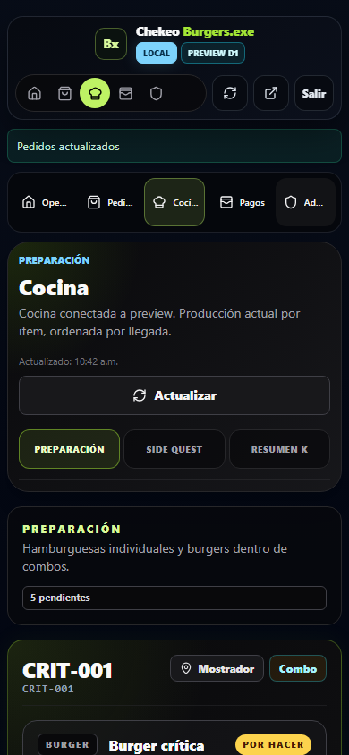

### Preparación — Accordion multi-item (mobile 390)

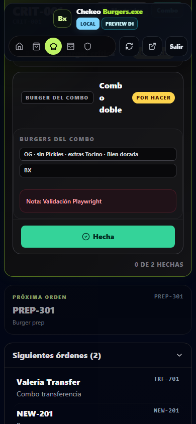

### Preparación — Próxima orden (mobile 390)

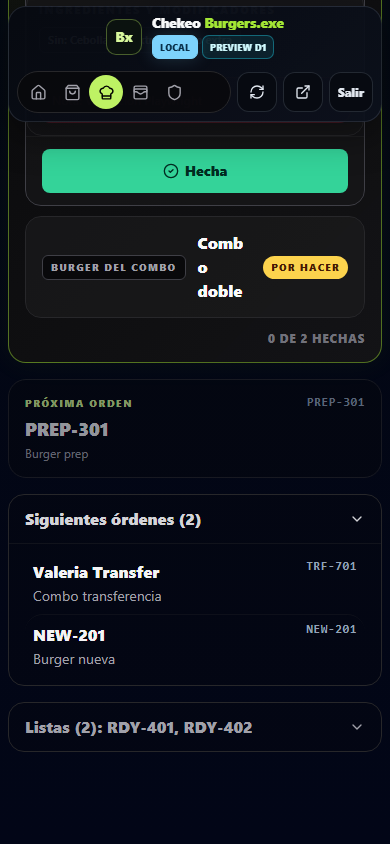

### Preparación — Siguientes órdenes (mobile 390)

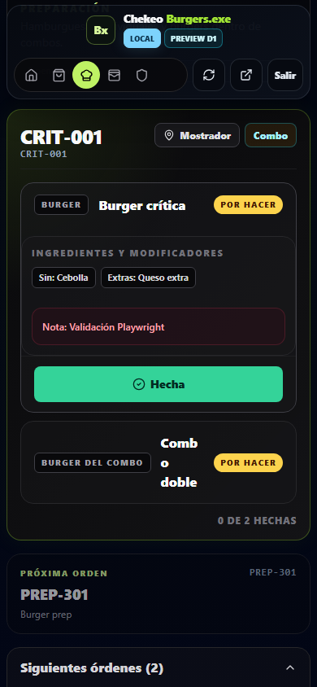

### Preparación — Listas (mobile 390)

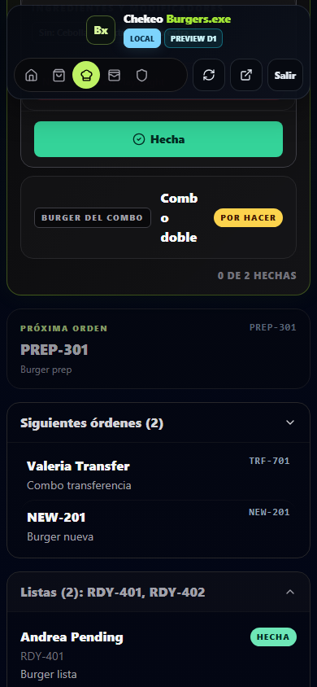

### Side Quest — Orden activa (mobile 390)

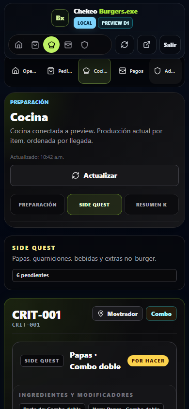

### Side Quest — Próxima orden (mobile 390)

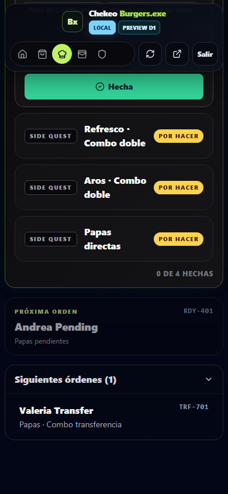

### Side Quest — Listas (mobile 390)

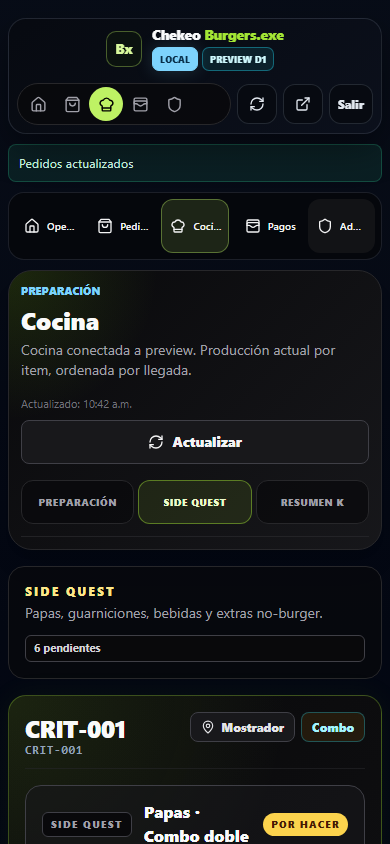

### Responsive — Mobile 320px

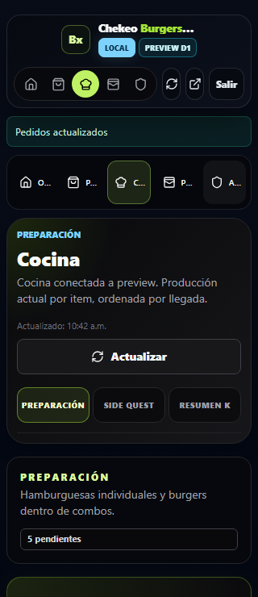

### Responsive — Mobile 430px

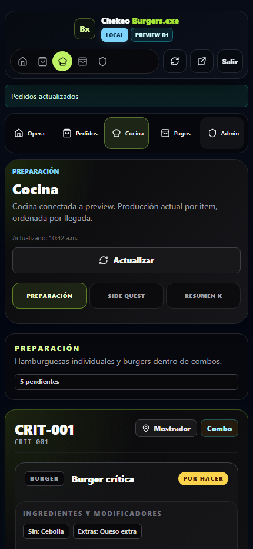

### Desktop 1280px — Overview

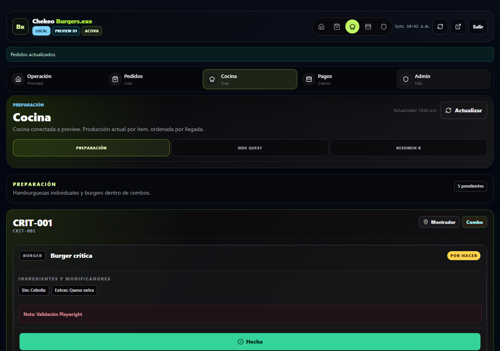

## Archivos modificados

| Archivo | Cambio |
|---|---|
| `apps/internal-chekeo-v2/src/components/kitchen/KitchenQueue.tsx` | Reestructura mayor — UX de línea de producción |
| `apps/internal-chekeo-v2/src/styles.css` | Bloque CSS de cocina reescrito |
| `tests/internal-chekeo/kitchen-production-board.spec.ts` | Assertions actualizados para layout agrupado |
| `tests/internal-chekeo/kitchen-screenshots.spec.ts` | **[NEW]** Script de captura de screenshots |
| `docs/chekeo-phase-2-3-kitchen-production-line.md` | **[NEW]** Este documento |
| `docs/assets/chekeo-phase-2-3-kitchen-production-line/` | **[NEW]** 11 screenshots capturados por Playwright |

## Componentes nuevos / refactored

- `buildOrderGroups()` — utilidad pura agrupando items por orden
- `ActiveOrderContainer` — maneja estado de accordion, animación glow, detección de combos
- `AccordionItemRow` — item individual con expand/collapse, acción "Hecha"
- `NextOrderPreview` — preview compacto tappable
- `FollowingOrdersSection` — lista colapsable con `onSelect` para saltar orden
- `DoneOrdersList` — resumen colapsado con detalle expandible
- `ProductionLanePanel` — compartido por tabs Preparación y Side Quest

## Accesibilidad

- `role=tablist`/`tab` con `aria-selected` en tabs de cocina
- `aria-label` en región de orden activa
- `aria-expanded` en todas las secciones colapsables
- Focus-visible en todos los elementos interactivos
- Touch targets 44px+ mantenidos
- `prefers-reduced-motion` heredado de utilidad animate existente

## Contratos preservados

Sin cambios en:

- Orders API payload (read/write)
- Payment, tickets, WhatsApp flows
- Google Sheets / Apps Script contracts
- Public URLs
- Resumen K logic (`fetchKitchenSummaryK`)
- Pedidos, Pagos, Sorteos, Catálogo, seeds, migraciones

## QA ejecutado

| Comando | Resultado |
|---|---|
| `npm run typecheck` | ✅ Clean |
| `npm run build` | ✅ public + internal |
| `npx playwright test --config=playwright.internal-kitchen.config.ts tests/internal-chekeo/kitchen-production-board.spec.ts` | ✅ 7 passed, 1 skipped |
| `npx playwright test --config=playwright.internal-kitchen.config.ts tests/internal-chekeo/kitchen-screenshots.spec.ts` | ✅ 11 passed |
| `git diff --check` | ✅ Sin whitespace issues |
| `graphify update .` | ✅ 1739 nodes, 3113 edges, 103 communities |
| `APP_TARGET=internal npm run build` | ⚠️ No es un script separado — cubierto por `npm run build` que ejecuta ambos targets |

## Riesgos

- El chunk JS de internal-chekeo-v2 sigue >500kB (pre-existente, no causado por este PR)
- El test admin-only está skipped por feature flag (comportamiento pre-existente)

## Qué NO se tocó

- Pedidos (orders flow, status transitions, cards)
- Pagos (payment modal, filters, cards)
- Sorteos (raffle module, tickets, referrals, adjustments)
- Ticket / WhatsApp (copy, payload, open action)
- Catálogo / Menú (SKUs, precios, categorías)
- Producción (Cloudflare Workers, D1, KV)
- Seeds / Migraciones (SQL, schemas)
- `package.json` / lockfiles / dependencias

## Recomendación de merge

PR listo para merge a `preview`. Todos los checks automatizados pasan. Se recomienda validación manual en dispositivo real para confirmar:

- [ ] Flujo de producción: marcar item → glow → auto-avance al siguiente
- [ ] Responsive: viewport 320px y 390px sin overflow horizontal
- [ ] Side Quest muestra items correctos (sin burgers)
- [ ] Resumen K carga y muestra métricas
